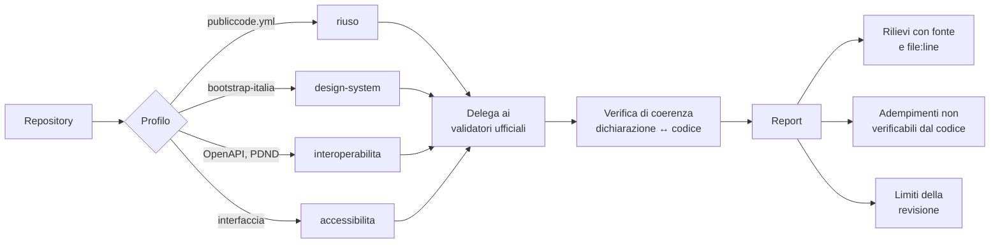

<div align="center">


### Revisione del codice per la Pubblica Amministrazione italiana

Una *agent skill* che verifica il codice destinato agli enti pubblici rispetto alle linee guida nazionali e agli obblighi del Codice dell'Amministrazione Digitale.

[](https://github.com/engineering87/pa-reviewer/actions/workflows/ci.yml)
[](./LICENSE)
[](./sources.yml)
[](./CHANGELOG.md)

<sub>Progetto indipendente. Non affiliato, promosso né approvato da AgID, dal Dipartimento per la trasformazione digitale o da altre istituzioni.<br>**Non è uno strumento di certificazione e non emette giudizi di conformità.**</sub>

</div>

---

## Il problema

Un repository di software pubblico dichiara questo:

```yaml
# publiccode.yml
it:
  conforme:
    gdpr: yes
    misureMinimeSicurezza: yes
  piattaforme:
    spid: yes
```

Il validatore ufficiale lo accetta senza obiezioni, ed è corretto che sia così: il suo
compito è verificare che quelle chiavi esistano e siano ben formate.

**Nessuno verifica che siano vere.** Il repository può non contenere una sola riga di
integrazione SPID. Può scrivere codici fiscali nei log mentre dichiara il rispetto del
GDPR. Può tenere una stringa di connessione in chiaro mentre dichiara conformità alle
misure minime di sicurezza.

Lo stesso vale un livello più in alto. Un componente riscritto a mano al posto di quello
di Bootstrap Italia compila, sembra plausibile in una revisione distratta, e perde
silenziosamente la gestione da tastiera che il componente ufficiale garantiva. Una
specifica OpenAPI supera il checker del ModI mentre il controller che dovrebbe
realizzarla espone tre rotte non documentate.

`pa-reviewer` lavora esattamente in questo spazio: **la distanza fra ciò che un progetto
dichiara di essere e ciò che il codice è.**

## Come funziona



**1. Determina il profilo.** Nessun progetto è soggetto all'intero perimetro. La skill
ispeziona il repository, attiva solo i moduli pertinenti e dichiara quali ha escluso.

**2. Delega dove esiste uno strumento ufficiale.** `publiccode-parser-go` per i metadati
del riuso, `api-oas-checker-rules` per le specifiche OpenAPI secondo il ModI, axe-core
per l'accessibilità a runtime. Questo progetto non ne riscrive la logica: li invoca e ne
cita l'output.

**3. Verifica ciò che quegli strumenti non possono vedere.** La coerenza fra
autodichiarazioni e codice, i domini privi di validatore, lo scostamento fra specifica di
interfaccia e implementazione.

## Esempio di rilievo

> Output illustrativo del formato, non risultato di un'esecuzione reale.

```text
Profilo rilevato: riuso, sicurezza | esclusi: design-system (nessuna interfaccia)
Copertura: 0 moduli stable, 1 beta, 5 stub

Sintesi: 1 important, 1 nit

── riuso ───────────────────────────────────────────────────────────────
[!] RIU-005   src/api/UserController.cs:88
    Il progetto dichiara il rispetto del GDPR (publiccode.yml,
    it.conforme.gdpr), ma questa riga emette il codice fiscale
    dell'utente nel log applicativo.
    Fonte: Lo Standard publiccode.yml, estensioni nazionali.
    Evidenza: inferita dal codice.

[·] RIU-006   publiccode.yml:41  (it.piattaforme.spid)
    Integrazione SPID dichiarata, nessun riscontro nel repository.
    Ricerca effettuata in: manifest delle dipendenze, configurazioni,
    variabili d'ambiente, manifest di deploy, client HTTP.
    Formulato come mancato riscontro: l'integrazione potrebbe risiedere
    in un componente esterno non incluso qui.

── Adempimenti non verificabili dal codice ─────────────────────────────
    Pubblicazione nel catalogo del riuso (art. 69 CAD).

── Limiti di questa revisione ──────────────────────────────────────────
    Modulo riuso in stato beta: rilievi non ancora validati su campione.
    spectral non disponibile: specifiche OpenAPI non verificate.
```

La sezione che conta di più è l'ultima. Un revisore che non dichiara cosa non ha
guardato non è utilizzabile in sede di collaudo.

## Installazione

```bash
git clone https://github.com/engineering87/pa-reviewer.git \
  ~/.claude/skills/pa-reviewer
```

La skill si attiva quando si rivede codice destinato a un ente pubblico italiano, o
quando il repository presenta segnali riconoscibili: `publiccode.yml`, dipendenza da
`bootstrap-italia`, riferimenti a PDND, SPID, CIE, ANPR, pagoPA.

Strumenti opzionali, invocati se presenti nell'ambiente: `publiccode-parser`,
`spectral`, `pa11y`, oppure `docker`. Quando mancano, la skill lo dichiara nel report
anziché sostituirli con un'impressione.

## Moduli

| Modulo | Stato | Copertura |
| :--- | :--- | :--- |
| `riuso` | **beta** | coerenza fra `publiccode.yml` e codice, 12 regole |
| `design-system` | stub | perimetro mappato, nessun validatore esistente altrove |
| `accessibilita` | stub | perimetro mappato |
| `interoperabilita` | stub | perimetro mappato |
| `sicurezza` | stub | perimetro mappato |
| `dati-aperti` | stub | perimetro mappato |
| `ia` | stub | in attesa dell'adozione definitiva delle linee guida |

Uno **stub** non emette mai rilievi: dichiara che il dominio è applicabile e che la
copertura non è implementata. Il perimetro può essere completo anche quando
l'implementazione non lo è, purché la differenza sia visibile a chi legge il report.

Il passaggio a **stable** richiede precisione misurata e pubblicata in
[`evaluation/`](./evaluation/README.md). Nessuna promozione senza numeri.

## Principi

> **Provenienza pubblica.** Ogni regola poggia su una fonte pubblicamente accessibile,
> registrata in [`sources.yml`](./sources.yml) con documento, atto, data, URL e livello
> di verifica. Una regola senza fonte fa fallire la build.

> **Nessun giudizio di conformità.** Il progetto produce evidenze e scostamenti. La
> conformità richiede attestazioni formali che nessuno strumento automatico può
> sostituire.

> **Evidenza prima dell'affermazione.** Un'affermazione sul comportamento del codice
> richiede una citazione `file:line`. Un mancato riscontro va formulato come tale,
> dichiarando dove si è cercato, così che l'autore possa smentirlo in una riga.

> **Ancoraggio al codice.** Un dominio entra nel perimetro solo se produce rilievi
> riferibili a una posizione nel codice. Procedure di gara, DPIA, conservazione
> documentale e qualificazione cloud restano fuori: sono adempimenti.

Politica completa in [`NORMATIVE_BASELINE.md`](./NORMATIVE_BASELINE.md).

## Manutenzione della baseline

Le fonti normative invecchiano, e in questo dominio lo fanno in fretta. La CI esegue un
controllo settimanale che **fa fallire la build** quando una fonte non è verificata da
oltre 180 giorni o quando una scadenza di revisione registrata è superata. La freschezza
non è affidata alla buona volontà del manutentore.

```bash
pip install pyyaml
python scripts/check_sources.py --sources sources.yml --rules rules/
python scripts/check_sources.py --sources sources.yml --check-urls
```

<details>
<summary><b>Struttura del repository</b></summary>

```
pa-reviewer/
├── SKILL.md                  profilo, delega, contratto di output
├── sources.yml               registro delle fonti, unica fonte di verità
├── NORMATIVE_BASELINE.md     politica di provenienza e manutenzione
├── references/               un file per modulo, caricato su richiesta
├── rules/                    regole operative, ognuna con la sua fonte
├── schema/                   formato dei rilievi
├── scripts/                  gate di CI e delega agli strumenti ufficiali
├── evaluation/               metodo e risultati di validazione
└── assets/                   identità visiva
```

</details>

<details>
<summary><b>Perimetro escluso, e perché</b></summary>

Un dominio entra solo se produce rilievi ancorabili a una posizione nel codice. Restano
deliberatamente fuori:

| Escluso | Motivo |
| :--- | :--- |
| Procedure di gara, valutazione comparativa ex art. 68 CAD | non ancorabili a `file:line` |
| Valutazione d'impatto sulla protezione dei dati | adempimento organizzativo |
| Processi di conservazione documentale | organizzativi, non di codice |
| Qualificazione dei servizi cloud | procedura amministrativa presso ACN |
| Attestazioni e dichiarazioni di accessibilità | richiedono sottoscrizione formale |

L'elenco vincolante è in [`sources.yml`](./sources.yml), sezione `out_of_scope`.

</details>

## Licenza

Rilasciato sotto **[EUPL-1.2](./LICENSE)**, la European Union Public Licence.

Puoi usare, studiare, modificare e ridistribuire il progetto, anche in ambito
commerciale. Se distribuisci una versione modificata devi renderne disponibile il
sorgente sotto EUPL-1.2 o sotto una delle licenze compatibili elencate nella licenza
stessa; l'uso interno senza distribuzione a terzi non fa scattare alcun obbligo.

La scelta non è casuale: EUPL-1.2 è adottata dagli strumenti ufficiali dell'ecosistema,
è fra quelle certificate da Open Source Initiative come richiesto dalle Linee guida su
acquisizione e riuso di software per le PA, ed è un copyleft con un elenco esplicito di
licenze compatibili, quindi non crea isole per chi voglia integrarlo. Le ragioni estese
sono in [`NOTICE.md`](./NOTICE.md).

## Contribuire

Le regole si aggiungono partendo dalla fonte, mai dal codice: prima la voce in
`sources.yml`, poi la regola che la riferisce, sempre con una guardia esplicita contro i
falsi positivi. Il vincolo di provenienza pubblica vale per chiunque ed è verificato
meccanicamente in CI: non è una dichiarazione d'intenti.

Dettagli in [`CONTRIBUTING.md`](./CONTRIBUTING.md), regole di convivenza in
[`CODE_OF_CONDUCT.md`](./CODE_OF_CONDUCT.md), segnalazioni di sicurezza in
[`SECURITY.md`](./SECURITY.md).
